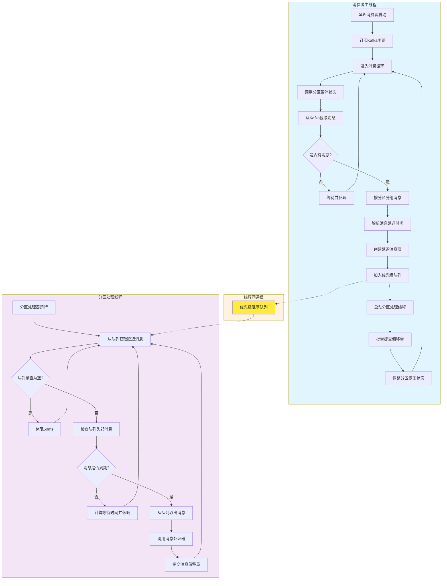

# D2K - Delay to Kafka

[](https://www.gnu.org/licenses/lgpl-3.0.html)
[](https://central.sonatype.com/artifact/io.github.xiajuan96/d2k-client)
[](https://www.oracle.com/java/)

## 什么是 D2K？

D2K（Delay to Kafka）是一个专注于 **Kafka 延迟消息处理** 的轻量级 Java SDK。基于标准的生产者-消费者设计模式，D2K 的创新性主要体现在消费端实现的**双线程异步处理机制**：构建**双通道异步处理引擎**，在消费者端实现基于优先级队列的精确时间控制和并行消息处理，为基于 Kafka 的分布式系统提供高性能、高精度的延迟消息处理能力。

### 核心定位

- **延迟消息处理利器**：专门解决 Kafka 生态中的延迟消息处理需求
- **消费端延迟架构**：创新的消费端延迟处理模式，避免传统方案的复杂性
- **企业级可靠性**：提供毫秒级精度控制和完整的一致性保障机制
- **开箱即用**：简单的 API 设计，最小化集成成本

### 主要功能

🚀 **延迟消息发送**：支持相对延迟时间和绝对时间两种发送模式  
⏰ **精确延迟消费**：毫秒级精度的延迟消息处理能力  
🎯 **双模式处理**：同步和异步两种处理模式，适应不同性能需求  
🔄 **智能流控**：内置背压控制和队列管理，防止系统过载  
📊 **顺序性保障**：确保同一分区内消息的处理顺序  
⚡ **高性能架构**：双线程异步设计，消息拉取与处理完全解耦

## 为什么选择 D2K？

### 🎯 技术优势对比

| 特性 | D2K | 传统延迟队列 | Kafka 时间轮 | 数据库轮询 |
|------|-----|-------------|-------------|------------|
| **部署复杂度** | ⭐⭐⭐⭐⭐ 极简 | ⭐⭐ 复杂 | ⭐⭐⭐ 中等 | ⭐⭐⭐⭐ 简单 |
| **精度控制** | ⭐⭐⭐⭐⭐ 毫秒级 | ⭐⭐⭐⭐ 秒级 | ⭐⭐⭐ 秒级 | ⭐⭐ 分钟级 |
| **性能表现** | ⭐⭐⭐⭐⭐ 极高 | ⭐⭐⭐ 中等 | ⭐⭐⭐⭐ 高 | ⭐⭐ 低 |
| **资源消耗** | ⭐⭐⭐⭐⭐ 极低 | ⭐⭐ 高 | ⭐⭐⭐ 中等 | ⭐⭐⭐ 中等 |
| **扩展性** | ⭐⭐⭐⭐⭐ 优秀 | ⭐⭐⭐ 中等 | ⭐⭐⭐⭐ 良好 | ⭐⭐ 有限 |
| **一致性保障** | ⭐⭐⭐⭐⭐ 强一致 | ⭐⭐⭐⭐ 最终一致 | ⭐⭐⭐ 中等 | ⭐⭐⭐⭐ 强一致 |

### 🚀 核心技术亮点

#### 1. 创新的消费端延迟架构
- **零额外存储**：无需 Redis、数据库等外部存储，直接基于 Kafka 实现
- **原生集成**：与现有 Kafka 基础设施无缝集成，无需额外部署
- **简化运维**：减少系统组件，降低运维复杂度和故障点

#### 2. 毫秒级精度控制
- **精确时间控制**：支持毫秒级延迟精度，满足高精度定时需求
- **智能休眠算法**：自适应休眠策略（1ms-200ms），平衡精度与性能
- **分段时间控制**：多级时间窗口，不同场景下的最优检查频率

#### 3. 双线程异步架构
- **完全解耦设计**：消息拉取与延迟处理在独立线程中执行
- **高性能队列**：基于 PriorityBlockingQueue 的无锁并发机制
- **智能流控**：内置背压控制，防止内存溢出和系统过载

#### 4. 企业级可靠性保障
- **顺序性保证**：确保同一分区内消息按正确顺序处理
- **一致性机制**：支持同步/异步两种模式的偏移量管理
- **故障恢复**：完整的消费者重平衡和优雅关闭机制

## 🔧 核心工作原理

### 发送端工作原理

  **消息标记**：生产者将延迟时间信息注入到 Kafka 消息头中

### 消费端工作原理

D2K 的消费端采用创新的 **双线程异步架构**，通过消费端延迟处理实现高性能的延迟消息处理：



#### 关键特性说明

1. **双线程解耦**：消息拉取与延迟处理在不同线程中执行，互不阻塞
2. **优先级队列**：基于到期时间自动排序，确保最早到期的消息优先处理
3. **智能休眠**：根据消息到期时间动态调整检查频率，平衡精度与性能
4. **一致性保障**：完整的偏移量管理机制，确保消息处理的可靠性

## 🚀 快速开始

### 系统要求

- **Java版本**：JDK 8 或更高版本
- **Kafka版本**：兼容 Apache Kafka 2.0+ 
- **依赖管理**：Maven 3.6+ 或 Gradle 6.0+

### 添加依赖

#### Maven

在你的 `pom.xml` 文件中添加以下依赖：

```xml
<dependency>
    <groupId>io.github.xiajuan96</groupId>
    <artifactId>d2k-client</artifactId>
    <version>1.0.1-SNAPSHOT</version>
</dependency>
```

#### Gradle

在你的 `build.gradle` 文件中添加以下依赖：

```gradle
implementation 'io.github.xiajuan96:d2k-client:1.0.1-SNAPSHOT'
```

### 基本使用示例

#### 1. 发送延迟消息

```java
import com.d2k.producer.DelayProducer;
import java.util.*;

public class DelayProducerExample {
    public static void main(String[] args) {
        // 创建Kafka生产者配置
        Map<String, Object> props = new HashMap<>();
        props.put("bootstrap.servers", "localhost:9092");
        props.put("key.serializer", "org.apache.kafka.common.serialization.StringSerializer");
        props.put("value.serializer", "org.apache.kafka.common.serialization.StringSerializer");
        
        // 创建延迟消息生产者
        DelayProducer<String, String> producer = new DelayProducer<>(props);
        
        try {
            // 发送延迟消息（5秒后消费）
            producer.sendDelayMessage("my-topic", "order-123", "订单处理", 5000L);
            
            // 发送定时消息（指定具体时间）
            long deliverAt = System.currentTimeMillis() + 30000; // 30秒后
            producer.sendTimedMessage("my-topic", "reminder-456", "提醒消息", deliverAt);
            
            System.out.println("延迟消息发送成功！");
        } finally {
            producer.close();
        }
    }
}
```

#### 2. 消费延迟消息

```java
import com.d2k.consumer.DelayConsumerContainer;
import com.d2k.consumer.DelayItemHandler;
import java.util.*;

public class DelayConsumerExample {
    public static void main(String[] args) {
        // 创建Kafka消费者配置
        Map<String, Object> consumerProps = new HashMap<>();
        consumerProps.put("bootstrap.servers", "localhost:9092");
        consumerProps.put("group.id", "my-consumer-group");
        consumerProps.put("key.deserializer", "org.apache.kafka.common.serialization.StringDeserializer");
        consumerProps.put("value.deserializer", "org.apache.kafka.common.serialization.StringDeserializer");
        consumerProps.put("auto.offset.reset", "earliest");
        
        // 创建消息处理器
        DelayItemHandler<String, String> handler = item -> {
            System.out.printf("处理延迟消息: key=%s, value=%s, 延迟时间已到！%n",
                item.getRecord().key(),
                item.getRecord().value());
            
            // 在这里添加你的业务逻辑
            // 例如：发送邮件、更新订单状态、执行定时任务等
        };
        
        // 创建延迟消息消费者容器
        DelayConsumerContainer<String, String> container = new DelayConsumerContainer<>(
            2, // 2个消费线程
            consumerProps,
            Arrays.asList("my-topic"),
            handler
        );
        
        // 启动消费者
        container.start();
        System.out.println("延迟消息消费者已启动，等待处理延迟消息...");
        
        // 添加关闭钩子，优雅关闭
        Runtime.getRuntime().addShutdownHook(new Thread(container::stop));
    }
}
```

### 运行效果

当你运行上述示例代码时，你会看到：

1. **生产者端**：延迟消息被成功发送到 Kafka
2. **消费者端**：消息会在指定的延迟时间后被精确处理
3. **控制台输出**：显示消息处理的详细信息和时间戳

> 💡 **提示**：更多高级用法（异步处理、配置优化、性能调优等）请参考 [高级使用指南](ADVANCED_USAGE.md)

## 📚 文档导航

根据你的需求，选择合适的文档：

- **🚀 [高级使用指南](ADVANCED_USAGE.md)**：详细配置、性能调优、最佳实践
- **👨‍💻 [开发者指南](DEVELOPER_GUIDE.md)**：API文档、技术实现、开发规范
- **❓ [常见问题](FAQ.md)**：故障排除、问题解答

## 🤝 贡献指南

我们欢迎社区贡献！如果你想为 D2K 项目做出贡献：

1. **提交 Issue**：报告 Bug 或提出新功能建议
2. **提交 Pull Request**：修复问题或实现新功能
3. **完善文档**：改进文档内容或添加使用示例
4. **分享经验**：在社区分享你的使用经验和最佳实践

详细的贡献流程请参考 [开发者指南 - 贡献流程](DEVELOPER_GUIDE.md#贡献流程)。

## 📄 许可证

本项目采用 [GNU Lesser General Public License v3.0 (LGPL-3.0)](https://www.gnu.org/licenses/lgpl-3.0.html) 开源许可证。

LGPL-3.0 是一个宽松的开源许可证，允许您：
- 自由使用、修改和分发本软件
- 在商业项目中使用本软件
- 将本软件作为库链接到您的应用程序中

如果您修改了本软件的源代码并分发，则必须在相同的 LGPL-3.0 许可证下提供修改后的源代码。

## 👨‍💻 作者

- **xiajuan96** - *项目创建者和主要维护者*

---

<div align="center">

**🚀 D2K - 让Kafka延迟消息处理变得简单而高效！**

*如果这个项目对你有帮助，请给我们一个 ⭐ Star！*

</div>