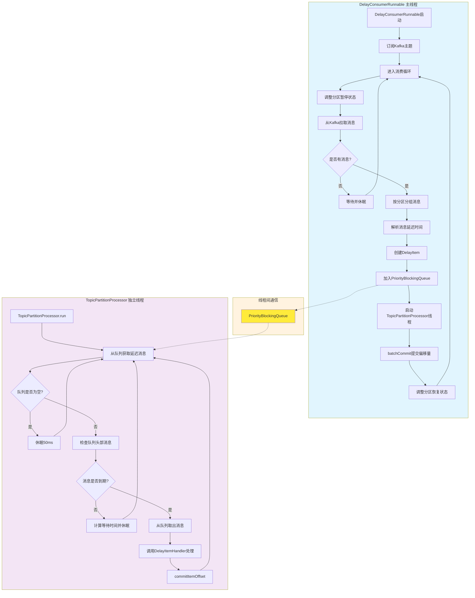

# D2K - Delay to Kafka

[](https://www.gnu.org/licenses/lgpl-3.0.html)
[](https://central.sonatype.com/artifact/io.github.xiajuan96/d2k-client)
[](https://www.oracle.com/java/)

D2K（Delay to Kafka）是一个高性能的Kafka延迟消息处理SDK，提供简单易用的API来发送和消费延迟消息。支持精确的时间控制、并发处理和灵活的配置选项。

## 功能特点

- **🚀 延迟消息发送**：支持指定延迟时间（毫秒）发送消息
- **⏰ 定时消息发送**：支持指定具体时间点发送消息
- **🎯 精确时间控制**：基于优先级队列实现精确的延迟控制
- **🔄 并发消费处理**：支持多线程并发消费延迟消息
- **🛡️ 高可用性**：支持Kafka消费者重平衡和故障恢复
- **📊 流量控制**：内置队列容量管理和分区暂停机制

## 项目结构

D2K项目包含以下模块：

- **d2k-client**：客户端模块，提供延迟消息发送和延迟消息消费能力
- **d2k-test**：测试模块

## 系统要求

- **Java版本**：JDK 8 或更高版本
- **Kafka版本**：兼容 Apache Kafka 2.0+ 
- **依赖管理**：Maven 3.6+ 或 Gradle 6.0+

## 安装

### Maven

在你的 `pom.xml` 文件中添加以下依赖：

```xml
<dependency>
    <groupId>io.github.xiajuan96</groupId>
    <artifactId>d2k-client</artifactId>
    <version>1.0.1-SNAPSHOT</version>
</dependency>
```

### Gradle

在你的 `build.gradle` 文件中添加以下依赖：

```gradle
implementation 'io.github.xiajuan96:d2k-client:1.0.1-SNAPSHOT'
```

### 核心依赖

D2K主要依赖以下组件：
- Apache Kafka Clients
- SLF4J 日志框架
- JUnit 5（测试依赖）

## 快速开始

## 使用方式

#### 发送延迟消息

```java
import com.d2k.producer.DelayProducer;

// 创建Kafka生产者配置
Map<String, Object> props = new HashMap<>();
props.put("bootstrap.servers", "localhost:9092");
props.put("key.serializer", "org.apache.kafka.common.serialization.StringSerializer");
props.put("value.serializer", "org.apache.kafka.common.serialization.StringSerializer");

// 创建延迟消息生产者
DelayProducer<String, String> producer = new DelayProducer<>(props);

// 发送延迟消息（5秒后消费）
producer.sendWithDelay("my-topic", "key1", "value1", 5000);

// 发送定时消息（在指定时间点消费）
long deliverAt = System.currentTimeMillis() + 10000; // 10秒后
producer.sendDeliverAt("my-topic", "key2", "value2", deliverAt);

// 关闭生产者
producer.close();
```

#### 使用配置化延迟生产者

```java
import com.d2k.producer.ConfigurableDelayProducer;
import com.d2k.config.DelayConfig;
import com.d2k.config.DelayConfigBuilder;

// 创建延迟配置
DelayConfig delayConfig = new DelayConfigBuilder()
    .withTopicDelay("topic1", 5000L)  // topic1默认延迟5秒
    .withTopicDelay("topic2", 3000L)  // topic2默认延迟3秒
    .withTopicPartitionDelay("topic3", 0, 1000L)  // topic3分区0延迟1秒
    .withTopicPartitionDelay("topic3", 1, 2000L)  // topic3分区1延迟2秒
    .build();

// 创建可配置延迟生产者
ConfigurableDelayProducer<String, String> configurableProducer = 
    new ConfigurableDelayProducer<>(props, delayConfig);

// 发送消息（使用配置的默认延迟时间）
configurableProducer.send("topic1", "key1", "value1");  // 自动延迟5秒
configurableProducer.send("topic3", 0, "key2", "value2");  // 自动延迟1秒

// 关闭生产者
configurableProducer.close();
```

#### 消费延迟消息

##### 基本用法（同步处理）

```java
import com.d2k.consumer.DelayConsumerContainer;
import com.d2k.consumer.DelayItemHandler;
import com.d2k.consumer.AsyncProcessingConfig;

// 创建Kafka消费者配置
Map<String, Object> consumerProps = new HashMap<>();
consumerProps.put("bootstrap.servers", "localhost:9092");
consumerProps.put("group.id", "my-group");
consumerProps.put("key.deserializer", "org.apache.kafka.common.serialization.StringDeserializer");
consumerProps.put("value.deserializer", "org.apache.kafka.common.serialization.StringDeserializer");
consumerProps.put("auto.offset.reset", "earliest");

// 添加D2K专有配置
consumerProps.put("d2k.loop.total.ms", 200L);  // 循环总时间
consumerProps.put("d2k.queue.capacity", 1000);  // 队列容量阈值

// 创建消息处理器
DelayItemHandler<String, String> handler = item -> {
    System.out.printf("处理延迟消息: topic=%s, partition=%d, offset=%d, key=%s, value=%s%n",
            item.getRecord().topic(),
            item.getRecord().partition(),
            item.getRecord().offset(),
            item.getRecord().key(),
            item.getRecord().value());
};

// 创建延迟消息消费者容器（同步处理）
DelayConsumerContainer<String, String> container = new DelayConsumerContainer<>(
    3, // 3个消费线程
    consumerProps,
    Arrays.asList("my-topic"),
    handler
);

// 启动消费者
container.start();

// 关闭消费者
container.stop();
```

##### 异步处理模式

```java
// 创建异步处理配置
AsyncProcessingConfig asyncConfig = AsyncProcessingConfig.createAsyncConfig(
    2,   // 核心线程数
    4,   // 最大线程数
    100  // 队列长度
);

// 创建延迟消息消费者容器（异步处理）
DelayConsumerContainer<String, String> container = new DelayConsumerContainer<>(
    3, // 3个消费线程
    consumerProps,
    Arrays.asList("my-topic"),
    handler,
    asyncConfig  // 异步处理配置
);

container.start();
```

## 工作原理

D2K基于Kafka消息头机制实现延迟消息处理，核心原理如下：

### 延迟消费核心流程



### 1. 消息延迟标记
- **生产者端**：通过消息头 `d2k-deliver-at` 标记消息的预期处理时间
- **时间计算**：支持相对延迟时间（毫秒）和绝对时间戳两种方式
- **透明传输**：延迟信息不影响消息体内容，保持业务数据完整性

### 2. 消费者端处理流程
- **消息拉取**：正常从Kafka拉取消息，不影响Kafka原生性能
- **延迟检测**：解析消息头中的 `d2k-deliver-at` 时间戳
- **队列管理**：未到期消息进入优先级队列等待，到期消息立即处理
- **分区暂停**：当队列容量达到上限时，暂停对应分区的消费

### 3. 精确时间控制
- **优先级队列**：基于 `PriorityQueue` 实现，确保消息按时间顺序处理
- **多线程处理**：支持多个消费线程并发处理到期消息
- **定时检查**：后台定时器定期检查队列，处理到期消息
- **毫秒级精度**：支持毫秒级的延迟时间控制

### 4. 高可用性保障
- **消费者重平衡**：支持Kafka消费者组重平衡，确保高可用
- **故障恢复**：消费者重启后自动恢复未处理的延迟消息
- **流量控制**：内置队列容量管理，防止内存溢出

## 配置选项

D2K采用配置分离设计，将Kafka原生配置与D2K专有配置分开管理：

### 配置分离原则

- **Kafka原生配置**：所有不以`d2k.`开头的配置项，直接传递给KafkaConsumer
- **D2K专有配置**：所有以`d2k.`开头的配置项，由D2kConsumerConfig类管理

### D2K专有配置

| 配置项 | 类型 | 默认值 | 说明 |
|--------|------|--------|------|
| `d2k.loop.total.ms` | Long | 200 | 消费循环总时间（毫秒），控制消费者轮询频率 |
| `d2k.queue.capacity` | Integer | 1000 | 内部队列容量阈值，超过此值将暂停分区消费 |

### Kafka原生配置

支持所有标准Kafka消费者配置，包括但不限于：

| 配置项 | 说明 |
|--------|------|
| `bootstrap.servers` | Kafka集群地址 |
| `group.id` | 消费者组ID |
| `client.id` | 客户端ID |
| `auto.offset.reset` | 偏移量重置策略 |
| `session.timeout.ms` | 会话超时时间 |
| `heartbeat.interval.ms` | 心跳间隔 |
| `max.poll.records` | 单次拉取最大记录数 |
| `max.poll.interval.ms` | 拉取间隔 |

#### 重要说明：enable.auto.commit 参数

**`enable.auto.commit` 参数在 D2K 中具有特殊性：**
- **默认值**：`false`
- **可修改性**：不可修改，系统会强制设置为 `false`
- **原因**：D2K 延迟消费需要精确控制偏移量提交时机，确保消息处理的可靠性
- **影响**：所有偏移量提交都由 D2K 内部机制自动管理，无需用户干预

### 异步处理配置

通过`AsyncProcessingConfig`类配置异步处理参数：

| 配置项 | 类型 | 默认值 | 说明 |
|--------|------|--------|------|
| `enabled` | Boolean | false | 是否启用异步处理 |
| `corePoolSize` | Integer | 2 | 核心线程数 |
| `maximumPoolSize` | Integer | 4 | 最大线程数 |
| `keepAliveTime` | Long | 60 | 线程空闲时间（秒） |
| `queueCapacity` | Integer | 100 | 任务队列长度 |
| `rejectedExecutionPolicy` | Enum | CALLER_RUNS | 拒绝策略 |

### 延迟配置

通过`DelayConfig`类配置主题和分区级别的默认延迟时间：

- **主题级别配置**：为整个主题设置默认延迟时间
- **分区级别配置**：为特定主题的特定分区设置延迟时间
- **互斥性**：同一主题不能同时配置主题级别和分区级别的延迟

### 生产者配置

生产者配置示例：

```java
Map<String, Object> producerProps = new HashMap<>();
// 标准Kafka配置
producerProps.put("bootstrap.servers", "localhost:9092");
producerProps.put("key.serializer", "org.apache.kafka.common.serialization.StringSerializer");
producerProps.put("value.serializer", "org.apache.kafka.common.serialization.StringSerializer");

// 注意：生产者只需要标准Kafka配置，延迟功能通过API方法实现
```

### 消费者配置

除了标准的Kafka消费者配置外，D2K支持以下扩展配置：

```java
Map<String, Object> consumerProps = new HashMap<>();
// 标准Kafka配置
consumerProps.put("bootstrap.servers", "localhost:9092");
consumerProps.put("group.id", "my-group");
consumerProps.put("key.deserializer", "org.apache.kafka.common.serialization.StringDeserializer");
consumerProps.put("value.deserializer", "org.apache.kafka.common.serialization.StringDeserializer");
consumerProps.put("auto.offset.reset", "earliest");

// D2K扩展配置
consumerProps.put("d2k.loop.total.ms", 500L);     // 检查间隔500ms
consumerProps.put("d2k.queue.capacity", 5000);    // 队列容量5000
consumerProps.put("d2k.pause.threshold", 0.9);    // 暂停阈值90%
```

## 高级用法

更多高级使用方式、详细配置说明和最佳实践，请参考 [高级使用指南](ADVANCED_USAGE.md)。


## 版本管理

本项目使用Maven Versions Plugin进行版本管理，推荐使用以下命令统一更新所有模块版本：

### 更新所有模块版本

更新根项目和所有子模块的版本，包括独立管理版本的模块：

**使用示例**：
```bash
# 第一步：更新根项目（这会同时更新d2k-test的父版本引用）
mvn versions:set -DnewVersion=1.0.2 -N

# 第二步：更新d2k-client独立模块
mvn versions:set -DnewVersion=1.0.2 -pl d2k-client

# 第三步：提交所有更改
mvn versions:commit
```

### 版本管理最佳实践

1. **开发阶段**：使用SNAPSHOT版本（如 `1.1.0-SNAPSHOT`）
2. **发布阶段**：使用正式版本（如 `1.1.0`）
3. **统一版本**：推荐使用方式3同时更新所有模块版本，保持版本一致性
4. **回滚操作**：如果需要撤销版本更改，可以使用 `mvn versions:revert`
5. **备份文件**：版本更新会自动创建备份文件（.versionsBackup），提交后自动删除

## 常见问题

更多常见问题和解决方案，请参考 [高级使用指南](ADVANCED_USAGE.md) 中的故障排除部分。

## 许可证

本项目采用 [GNU Lesser General Public License v3.0 (LGPL-3.0)](https://www.gnu.org/licenses/lgpl-3.0.html) 开源许可证。

LGPL-3.0 是一个宽松的开源许可证，允许您：
- 自由使用、修改和分发本软件
- 在商业项目中使用本软件
- 将本软件作为库链接到您的应用程序中

如果您修改了本软件的源代码并分发，则必须在相同的 LGPL-3.0 许可证下提供修改后的源代码。

## API 接口文档

详细的API接口文档，请参考 [高级使用指南](ADVANCED_USAGE.md) 中的API参考部分。

## 贡献

欢迎提交Issue和Pull Request来改进这个项目！

## 作者

- **xiajuan96** - *项目维护者* - [GitHub](https://github.com/xiajuan96)